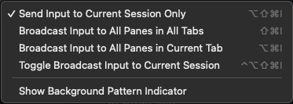

### What:

This tool will launch a new iTerm2 window and create split panes for each session. By broadcasting commands (alt+cmd+i) you have a perfect clusterssh tool.

I used to use https://github.com/wouterdebie/i2cssh for SSH clustering. It's dependant on Ruby and also tends to break on each OSX/Ruby upgrade. I got tired of this, so I made my own version which relies only on python (sys, subprocess, argparse) and the built in OSX osascript binary.

### Install:

Just download the script to your PATH, then make it executable. Example:

```
sudo curl -o /usr/local/bin/i2c https://raw.githubusercontent.com/senilio/i2c/master/i2c && \
sudo chmod +x /usr/local/bin/i2c
```

### iTerm2 Broadcast input:

Be careful when broadcasting your keyboard strokes, as it's easy to unintentionally mess up. See the following screenshot from iTerm2 for a description of the different broadcast modes plus keyboard combinations on how to enable and disable them.



### Usage:

```
usage: i2c [-h] [-p port] [-l login] [-d] ...

positional arguments:
  servers

optional arguments:
  -h, --help  show this help message and exit
  -p port     Optional: Connect to this SSH port. Defalts to port 22.
  -l login    Optional: Connect as this SSH user. Defaults to current user.
  -d          Enable debug output
```

Examples:

```
i2c 10.0.0.{1..5}
i2c root@10.0.0.{1..5}
i2c root@10.0.0.1 user@10.0.0.2
i2c -p 123 -l user 10.0.0.{1..5}
i2c 10.0.0.1 10.0.0.2 10.0.0.3 10.0.0.4
```

Script will try to enable broadcast mode after creating the new window.
